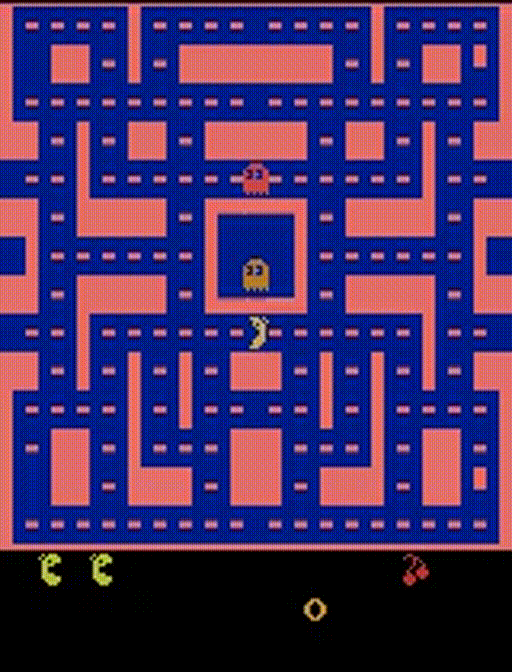
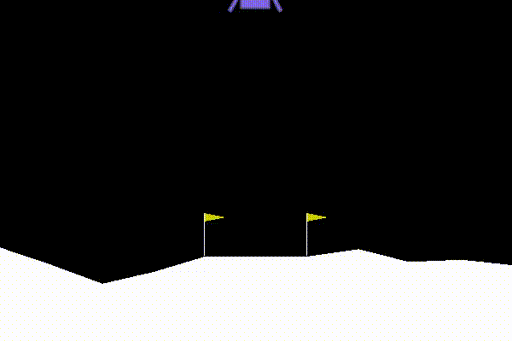

# demo

## MsPacmanNoFrameskip-v0
* deep Q learning

|training episodes |250 | 440 | 600|
| --- | --------- | ------ | ------- | 
| GIF| | | |
## LunarLander-v2
* policy gradient
|training episodes |100 | 300 | 600|
| --- | --------- | ------ | ------- | 
| GIF| | | |


# training 
## dqn (1000000 steps)
python3 main.py --train_dqn --cpt_dir ./
## dueling DQN, double DQN
python3 main.py --train_dqn --double_dqn True --cpt_dir $cpt_save_dir
python3 main.py --train_dqn --dueling_dqn True --cpt_dir $cpt_save_dir
## train pg
python3 main.py --train_pg --cpt_dir ./
# pg with baseline
python3 main.py --train_pg --basline_pg True --cpt_dir $cpt_dir

# testing
## dqn
```
python3 test.py --test_dqn --cpt_dir ./
```
## dueling DQN, double DQN
```
python3 test.py --test_dqn --cpt_dir $cpt_dir --double_dqn True
python3 test.py --test_dqn --cpt_dir $cpt_dir --double_dqn True
```
## pg
python3 test.py --test_pg --cpt_dir ./
## pg with baseline
python3 test.py --test_pg --baseline_pg True --cpt_dir $cpt_dir


