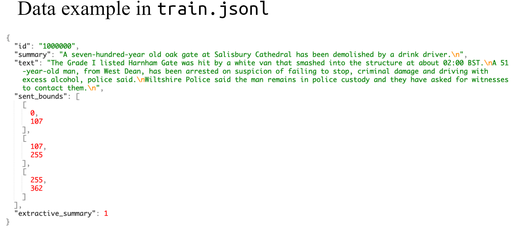
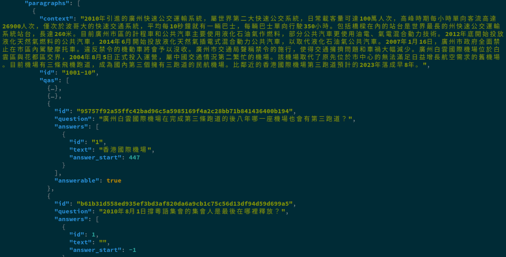
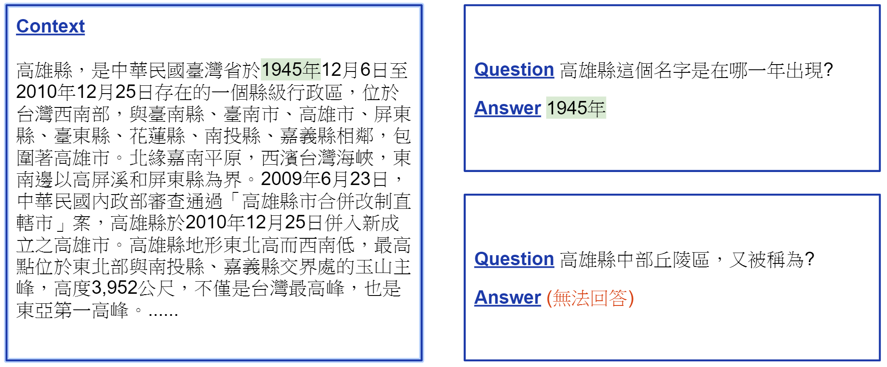

# Deep_Learning_Text

Applied Deep Learning (2020 Spring) @ NTU

Three Homework as follows:
   1. Extractive and Abstractive Summarization (https://docs.google.com/presentation/d/1omvZRbcbpo1gQ2hlktPV9gZzuAfEHcsJa18IoytgQjk/edit#slide=id.g8130877143_0_0)
   * train file format
   
   
   2. Bert for Chinese QAS (https://docs.google.com/presentation/d/1OKenehP3x1mrYIlLS3OHV9f178nn809SE23MFk_QCLE/edit#slide=id.p)
   * QAS example 
   
   * train file format
   
   3. Deep Reinforcement Learning playing games (https://docs.google.com/presentation/d/12IjcsZVCKjcsHtCRKSJfku3HWlGN4yc9DvCT6XRJZlk/edit#slide=id.p)
