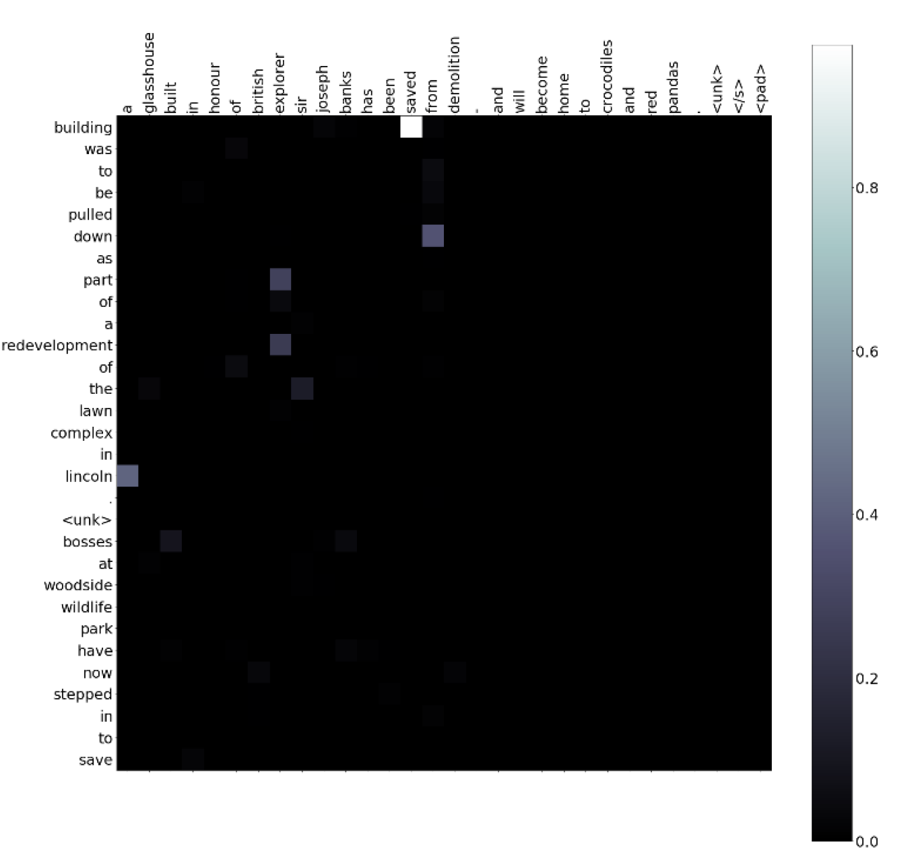

# extractive_abstractive_summarization
* [Homework 1 Slide](https://docs.google.com/presentation/d/1omvZRbcbpo1gQ2hlktPV9gZzuAfEHcsJa18IoytgQjk/edit#slide=id.g8130877143_0_0)
* [Data](https://drive.google.com/drive/folders/1L_ayPqKlm6KmimjTHvheLQgm2EZfajh4)
* [pretrainData](https://drive.google.com/drive/folders/1xIU1EoUf0P5z0tRmcVH5zz7APwFZ4BWe)

## 0. Requirements
```
torch
tqdm
spacy
rouge_score

gdrive
```
## 1. download Data
```
sh download.sh
```
## 2. Training and Prediction
```
python3 seq_tag_train.py 
python3.7 seq2seq_train.py
sh  extractive.sh /path/to/test.jsonl /path/to/output/predict.jsonl
sh  attention.sh /path/to/test.jsonl /path/to/output/predict.jsonl
sh  seq2seq.sh  /path/to/test.jsonl /path/to/output/predict.jsonl
```

## 3. Results

| Method | Rouge-1 | Rouge-2 | Rouge-L | 
| --- | --------- | ------ | ------- | 
| extractive      | 0.1658 | 0.0256 |0.1145            |
| seq2seq      | 0.208 |  0.0464 | 0.1666 |
| seq2seq_attention      | 0.248         | 0.8931 | 0.2142  |

### attention plot

 


